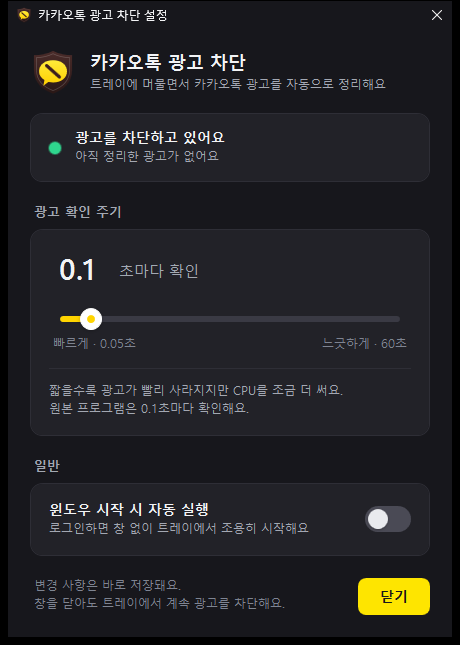
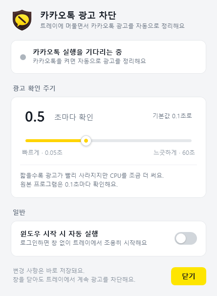
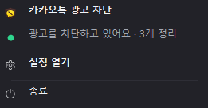

# 카카오톡 광고 차단 (KakaoTalkAdBlockPlus)

카카오톡 PC의 광고(친구·채팅 목록 아래 배너, 광고 팝업)를 자동으로 정리하는 트레이 프로그램입니다.
[KakaoTalkAdBlock](https://github.com/blurfx/KakaoTalkAdBlock)(Go)의 동작을 C# / WPF로 다시 만들고,
트레이 메뉴와 설정창을 더했습니다.

| 설정창 (다크) | 설정창 (라이트) | 트레이 우클릭 메뉴 |
| --- | --- | --- |
|  |  |  |

## 사용법

1. `KakaoTalkAdBlockPlus.exe`를 원하는 폴더에 두고 실행합니다. 설치는 필요 없습니다.
2. 창 없이 **알림 영역(트레이)** 에 머물면서 카카오톡을 감시하고 광고를 정리합니다.
   직접 실행했을 때만 "시작됐어요" 알림이 한 번 뜹니다.
3. 트레이 아이콘을
   - **오른쪽 클릭** → 상태 · **설정 열기** · **종료**
   - **왼쪽 두 번 클릭** → 설정창
4. 이미 실행 중일 때 exe를 다시 실행하면, 새로 뜨지 않고 실행 중인 프로그램의 설정창이 열립니다.

### 설정

| 항목 | 설명 |
| --- | --- |
| 광고 확인 주기 | 카카오톡 창을 검사하는 간격. 기본값은 원본과 같은 **0.1초**. 슬라이더(0.05초 ~ 60초)로 고르거나 숫자를 눌러 직접 입력(Enter)합니다. 짧을수록 광고가 빨리 사라지고, 길수록 CPU를 덜 씁니다. |
| 윈도우 시작 시 자동 실행 | 켜면 로그인할 때 창 없이 트레이에서 조용히 시작합니다. 작업 관리자 [시작 앱]에서 끈 상태도 그대로 보여 주고, 스위치를 다시 켜면 작업 관리자 쪽 "사용 안 함"도 풀립니다. |

변경 사항은 바로 적용·저장되며 재부팅 후에도 유지됩니다.

- 확인 주기: `%APPDATA%\KakaoTalkAdBlockPlus\settings.json`
- 자동 실행: `HKCU\Software\Microsoft\Windows\CurrentVersion\Run`의 `KakaoTalkAdBlockPlus` 값
  (exe를 다른 폴더로 옮겨도 다음 실행 때 경로를 자동으로 고칩니다)

### 완전히 지우기

트레이 메뉴 → 종료, 설정창에서 자동 실행을 끈 뒤 exe와 `%APPDATA%\KakaoTalkAdBlockPlus` 폴더를 지우면 됩니다.

## 원본(2.1.4)과 달라진 점

| | 원본 KakaoTalkAdBlock 2.1.4 | 이 프로그램 |
| --- | --- | --- |
| 종료 | 트레이 아이콘 두 번 클릭 | 우클릭 메뉴 → 종료 |
| 설정 | 없음 | 설정창 (확인 주기, 자동 실행), 재부팅 후 유지 |
| 확인 주기 | 0.1초 고정 | 0.05초 ~ 60초 (기본 0.1초), 바꾸면 즉시 적용 |
| 광고 탐지 규칙 | 구 클라이언트용 | 원본 최신판 2.2.4의 **일반(Win32) 클라이언트 규칙** — 설치된 카카오톡 26.8.1에서 동작 확인 |
| 카카오톡 찾기 | 1초마다 전체 프로세스 스냅숏 (핸들 누수 있음) | 창 소유 프로세스의 실행 파일 이름 확인 (가볍고 누수 없음) |
| 중복 실행 | 막지 않음 | 한 번만 실행, 두 번째 실행은 설정창 열기 |

### 광고를 정리하는 규칙

카카오톡(`KakaoTalk.exe`) 창에 대해서만, 원본 최신판과 같은 규칙을 씁니다.

1. **하단 배너**: 제목이 있는 메인 창(`EVA_Window_Dblclk`) 안에 친구/채팅 목록(`OnlineMainView…`)이나 잠금 화면(`LockModeView…`)이 있으면,
   첫 번째를 뺀 직계 자식 중 이름 없는 `EVA_ChildWindow`에 `WM_CLOSE`를 보냅니다.
   - 동영상 플레이어처럼 목록 화면이 없는 창은 건드리지 않습니다 (원본 #99).
   - 카카오톡 자체 스크롤(`_EVA_…`)이 들어 있는 화면(이모티콘 화면 등)은 닫지 않습니다 (원본 #97).
2. **빈자리 메우기**: 목록 화면을 (창 폭 − 2, 창 높이 − 31)로, 잠금 화면을 (창 폭 − 2, 창 높이)로 늘립니다.
3. **광고 팝업**: 이름 없는 `EVA_Window`(또는 메인 창이 소유한 이름 없는 `EVA_Window_Dblclk`) 안에
   광고 웹뷰(`Chrome Legacy Window`)가 있으면 숨깁니다.

### 참고

- 필요한 것: Windows 10/11 (기본 포함된 .NET Framework 4.8). 관리자 권한은 필요 없습니다.
- 자원 사용(이 PC, 카카오톡 실행 중, 0.1초 주기): CPU 코어 1개의 약 0.5% 안팎, 메모리 약 50MB.
- 카카오톡 **Qt6 베타(KakaoTalkUI.exe)** 는 지원하지 않습니다. 원본 2.2.4의 베타 지원은 창 영역을 잘라 내는 방식이라 따로 옮기지 않았습니다.
- 카카오톡이 창 구조를 바꾸면 규칙이 맞지 않을 수 있습니다. 그때는 원본 저장소의 변경 사항을 참고해 `AdBlock/AdBlockEngine.cs`의 규칙을 고치면 됩니다.
- 예상하지 못한 오류는 `%APPDATA%\KakaoTalkAdBlockPlus\error.log`에 남습니다.

## 빌드

Visual Studio 2022 이상(또는 Build Tools, MSBuild 포함)이 필요합니다.

```powershell
powershell -ExecutionPolicy Bypass -File build.ps1                                   # 디버그 빌드 + 전체 테스트
powershell -ExecutionPolicy Bypass -File build.ps1 -Configuration Release -Publish   # 릴리스 빌드 + 테스트 + dist\ 복사
```

결과물은 `dist\KakaoTalkAdBlockPlus.exe` 한 파일(약 200KB)입니다.
아이콘을 고쳤다면 `tools\Generate-Icon.ps1`로 `AppIcon.ico`를 다시 만듭니다.

### 구조

```
src/KakaoTalkAdBlockPlus/
  AdBlock/    광고 제거 엔진(규칙), 백그라운드 서비스, 상태 집계, 카카오톡 프로세스 찾기
  Native/     Win32 API (창 열거/닫기/숨기기/크기 조정, 프로세스 이름, DWM)
  Settings/   확인 주기, 설정 저장(JSON)
  Startup/    자동 실행(레지스트리), 명령줄, 중복 실행 방지
  UI/         설정창(WPF)과 뷰모델, 트레이 아이콘/메뉴, 테마(라이트/다크)
tests/KakaoTalkAdBlockPlus.Tests/   MSTest (가짜 창 트리 + 테스트 프로세스 안의 진짜 Win32 창)
plan.md     TDD 테스트 목록 ("go" → 다음 테스트)
```
