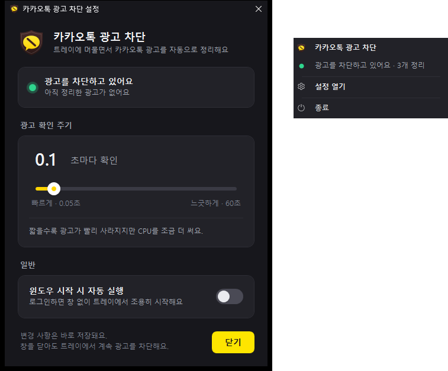

# 카카오톡 광고 차단 (KakaoTalkAdBlockPlus)

[](https://github.com/dbswhdrbs/KakaoTalkAdBlockPlus/releases/latest)


[](LICENSE)

카카오톡 PC의 **친구·채팅 목록 아래 배너 광고와 광고 팝업을 자동으로 정리**하는 Windows 프로그램입니다.
실행해 두면 창 없이 **알림 영역(트레이)** 에 머물면서 카카오톡을 지켜봅니다.



## 주요 기능

- **광고 자동 정리** — 하단 배너 광고를 닫고 그 자리를 목록으로 채우며, 광고 팝업(웹뷰)은 숨깁니다
- **트레이 상주** — 오른쪽 클릭 메뉴(상태 · 설정 열기 · 종료), 왼쪽 두 번 클릭으로 설정창
- **확인 주기 조절** — 0.05초 ~ 60초(기본 0.1초), 슬라이더로 고르거나 숫자를 직접 입력, 바로 적용
- **윈도우 시작 시 자동 실행** — 로그인하면 창 없이 트레이에서 조용히 시작 (작업 관리자 [시작 앱] 상태도 반영)
- **설정 유지** — 재부팅해도 그대로 남습니다
- **가볍게** — exe 한 파일(약 200KB), 설치 없음, CPU 사용은 코어 1개의 1% 미만
- 윈도우 다크/라이트 테마 자동 적용, 한 번만 실행(다시 실행하면 설정창이 열림), 카카오톡이 "응답 없음"이어도 같이 멈추지 않음

## 다운로드와 실행

[Releases](https://github.com/dbswhdrbs/KakaoTalkAdBlockPlus/releases/latest)에서 `KakaoTalkAdBlockPlus.exe`를 받아
원하는 폴더에 두고 실행하면 됩니다. 설치할 것은 없습니다.

- Windows 10/11 (필요한 .NET Framework 4.8은 Windows에 기본으로 들어 있습니다). 관리자 권한은 필요 없습니다.
- 서명되지 않은 exe라서 처음 실행할 때 "Windows의 PC 보호" 창이 뜨면 **추가 정보 → 실행**을 누르세요.
- 직접 실행하면 "시작됐어요" 알림이 한 번 뜨고, 이후에는 트레이 아이콘으로만 보입니다.
- 직접 빌드하려면 아래 [개발자용](#개발자용)을 보세요.

## 사용법

### 트레이 아이콘

| 동작 | 결과 |
| --- | --- |
| 오른쪽 클릭 | 현재 상태 · **설정 열기** · **종료** 메뉴 |
| 왼쪽 두 번 클릭 | 설정창 |
| exe를 한 번 더 실행 | 새로 뜨지 않고, 실행 중인 프로그램의 설정창이 열림 |

설정창을 닫아도 트레이에서 계속 광고를 정리합니다. 완전히 끄려면 메뉴의 **종료**를 누르세요.

### 설정

| 항목 | 설명 |
| --- | --- |
| 광고 확인 주기 | 카카오톡 창을 검사하는 간격입니다. 슬라이더(0.05초 ~ 60초)로 고르거나, 숫자를 눌러 직접 입력하고 Enter를 누릅니다. 짧을수록 광고가 빨리 사라지고, 길수록 CPU를 덜 씁니다. **기본값 0.1초로** 버튼으로 되돌릴 수 있습니다. |
| 윈도우 시작 시 자동 실행 | 켜면 로그인할 때 창 없이 트레이에서 시작합니다. 작업 관리자 [시작 앱]에서 "사용 안 함"으로 바꾼 상태도 그대로 보여 주고, 스위치를 다시 켜면 그쪽도 풀립니다. |

변경 사항은 바로 적용·저장됩니다. 설정창은 윈도우 테마를 따라가며, 라이트 테마에서는 이렇게 보입니다.


- 확인 주기: `%APPDATA%\KakaoTalkAdBlockPlus\settings.json`
- 자동 실행: `HKCU\Software\Microsoft\Windows\CurrentVersion\Run`의 `KakaoTalkAdBlockPlus` 값
  (exe를 다른 폴더로 옮겨도 다음 실행 때 경로를 알아서 고칩니다)

### 완전히 지우기

트레이 메뉴 → **종료**, 설정창에서 자동 실행을 끈 뒤 exe와 `%APPDATA%\KakaoTalkAdBlockPlus` 폴더를 지우면 됩니다.

## 동작 방식

카카오톡(`KakaoTalk.exe`)이 만든 창만 살펴보고, 확인 주기마다 아래 규칙을 적용합니다.
"메인 창 후보"는 제목이 있고 소유자가 없는 `EVA_Window_Dblclk` 창입니다 (카카오톡 본 창, 채팅방, 동영상 플레이어 등).

1. **하단 배너** — 메인 창 후보 안에 친구/채팅 목록(`OnlineMainView…`)이나 잠금 화면(`LockModeView…`)이 있으면,
   첫 번째를 뺀 직계 자식 중 이름 없는 `EVA_ChildWindow`에 `WM_CLOSE`를 보냅니다.
   - 목록 화면이 없는 창(동영상 플레이어 등)은 건드리지 않습니다.
   - 카카오톡 자체 스크롤(`_EVA_…`)이 들어 있는 화면(이모티콘 화면 등)은 광고가 아니므로 닫지 않습니다.
2. **빈자리 메우기** — 목록 화면을 (창 폭 − 2, 창 높이 − 31)로, 잠금 화면을 (창 폭 − 2, 창 높이)로 늘립니다.
   이미 맞는 크기면 건드리지 않습니다.
3. **광고 팝업** — 이름 없는 창 중 소유자가 없는 `EVA_Window`, 또는 메인 창 후보가 소유한 `EVA_Window_Dblclk` 안에
   광고 웹뷰(`Chrome Legacy Window`)가 있으면 숨깁니다.

창을 숨기거나 크기를 바꾸는 요청은 기다리지 않고 보내므로(`ShowWindowAsync`, `SWP_ASYNCWINDOWPOS`),
카카오톡이 "응답 없음"이어도 이 프로그램이 같이 멈추지 않습니다.
카카오톡 프로세스는 전체 프로세스 목록 대신 창을 가진 프로세스의 실행 파일 이름으로 찾아 가볍게 동작합니다.

## 알아 두기

- 카카오톡과 관련 없는 **비공식 개인 프로젝트**입니다. 카카오톡이 창 구조를 바꾸면 광고를 못 찾을 수 있습니다.
  이때는 `src/KakaoTalkAdBlockPlus/AdBlock/AdBlockEngine.cs`의 규칙을 고치면 됩니다.
- 카카오톡이 **관리자 권한**으로 실행돼 있으면(설치·업데이트 직후 설치 프로그램이 띄운 경우 등) 윈도우 보안 정책 때문에
  카카오톡 창을 건드릴 수 없습니다. 카카오톡을 다시 시작하거나 이 프로그램도 관리자 권한으로 실행하세요.
- 카카오톡 **Qt6 베타(KakaoTalkUI.exe)** 는 지원하지 않습니다.
- 예상하지 못한 오류는 `%APPDATA%\KakaoTalkAdBlockPlus\error.log`에 남습니다.

## 개발자용

### 빌드와 테스트

Visual Studio 2022 이상(또는 Build Tools, MSBuild 포함)이 필요합니다. 테스트 패키지(MSTest)는 빌드할 때 NuGet에서 자동으로 받습니다.

```powershell
powershell -ExecutionPolicy Bypass -File build.ps1                                   # 디버그 빌드 + 전체 테스트
powershell -ExecutionPolicy Bypass -File build.ps1 -Configuration Release -Publish   # 릴리스 빌드 + 테스트 + dist\ 복사
```

결과물은 `dist\KakaoTalkAdBlockPlus.exe` 한 파일입니다. 아이콘을 고쳤다면 `tools\Generate-Icon.ps1`로 `AppIcon.ico`를 다시 만듭니다.

### 구조

```
src/KakaoTalkAdBlockPlus/
  AdBlock/    광고 제거 규칙(AdBlockEngine), 백그라운드 서비스, 상태 집계, 카카오톡 프로세스 찾기
  Native/     Win32 API: 창 열거·닫기·숨기기·크기 조정, 프로세스 이름, DWM(제목 표시줄·둥근 모서리)
  Settings/   확인 주기, 설정 저장(JSON)
  Startup/    윈도우 시작 시 자동 실행(레지스트리), 명령줄(--autostart), 중복 실행 방지
  UI/         설정창(WPF)과 뷰모델, 트레이 아이콘·메뉴, 라이트/다크 테마
tests/KakaoTalkAdBlockPlus.Tests/   MSTest — 가짜 창 트리 + 테스트 프로세스 안의 진짜 Win32 창
tools/Generate-Icon.ps1             XAML 벡터 아이콘 → 여러 크기의 .ico
plan.md                             테스트 목록 (TDD)
```

### 개발 방식

테스트 주도 개발(TDD)로 만들었습니다. `plan.md`의 테스트를 하나씩 레드 → 그린 → 리팩터 순서로 구현했고,
커밋은 행위 변경(`[행위]`)과 구조 변경(`[구조]`)을 나눴습니다.

## 라이선스

[MIT](LICENSE)
